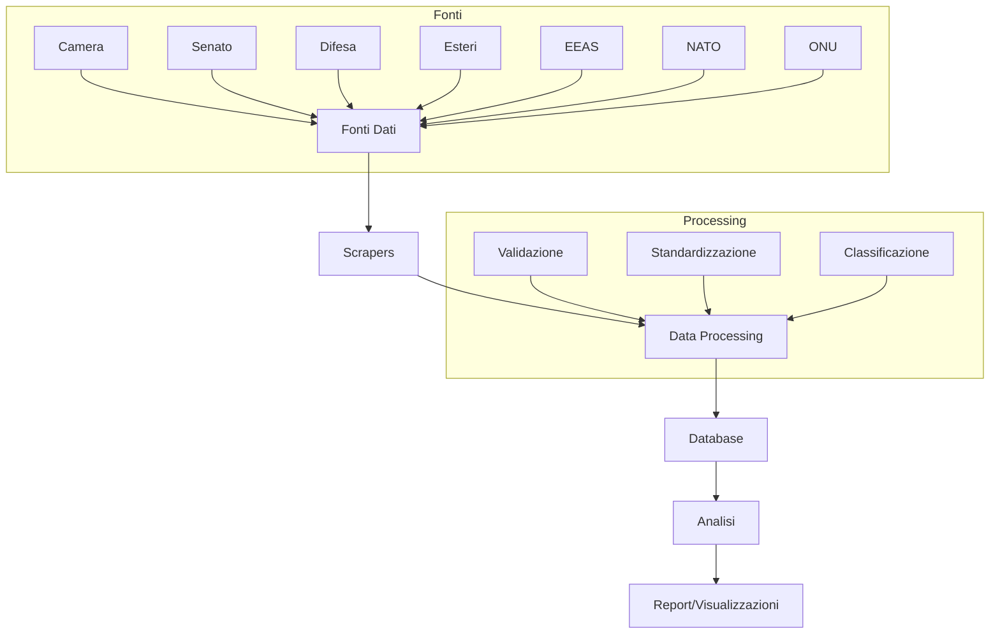
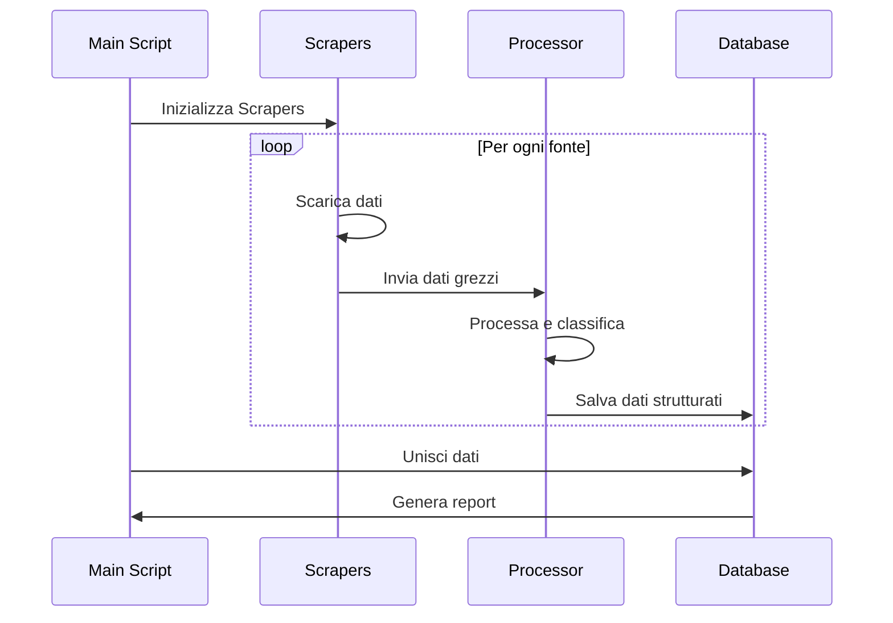

# 🌍 Missioni Internazionali Italiane - Data Scraper & Analyzer

## 📊 Panoramica del Progetto

Questo progetto automatizza la raccolta, l'analisi e la classificazione dei dati relativi alle missioni internazionali italiane da diverse fonti istituzionali.

### 🎯 Obiettivi

1. **Raccolta Dati**
   - Estrarre automaticamente dati da fonti ufficiali
   - Standardizzare i dati in un formato unificato
   - Mantenere uno storico delle missioni

2. **Classificazione**
   - Categorizzare le missioni per tipo (UE, NATO, ONU, etc.)
   - Identificare missioni ibride/multilaterali
   - Tracciare evoluzione temporale delle missioni

3. **Analisi**
   - Generare report automatici
   - Visualizzare trend e pattern
   - Supportare decisioni strategiche

## 🏗️ Architettura del Sistema



## 📁 Struttura del Progetto

```
Missioni_Internazionali_Scraper/
├── scripts/
│   ├── base_scraper.py      # Classe base per gli scraper
│   ├── web_scraper.py       # Scraper per siti web
│   ├── camera_scraper.py    # Scraper Camera dei Deputati
│   ├── senato_scraper.py    # Scraper Senato
│   ├── difesa_scraper.py    # Scraper Ministero Difesa
│   ├── esteri_scraper.py    # Scraper Ministero Esteri
│   ├── eeas_scraper.py      # Scraper EEAS (UE)
│   ├── nato_scraper.py      # Scraper NATO
│   ├── un_scraper.py        # Scraper ONU
│   └── main.py             # Script principale
├── data/
│   ├── raw/                # Dati grezzi (PDF, HTML)
│   ├── processed/          # Dati processati (CSV)
│   └── final/             # Dataset finale
├── config/
│   └── config.yaml        # Configurazione
├── logs/                  # Log files
└── notebooks/            # Analisi e visualizzazioni
```

## 🔄 Flusso dei Dati



## 📊 Schema di Classificazione

### 1. 🇪🇺 Missioni UE (CSDP/PESD)
- **Civili (CP) CSDP**
  - EUPOL, EUBAM, EULEX
  - Focus: Formazione polizia, stato di diritto
- **Militari (MP) CSDP**
  - EUTM Mali, EUNAVFOR MED
  - Focus: Training eserciti, anti-pirateria

### 2. 🌐 Missioni NATO
- **Peacekeeping & Deterrence**
  - KFOR Kosovo, NATO Air Policing
- **Training & Support**
  - NATO Iraq Mission, Resolute Support
- **Security Operations**
  - Enhanced Forward Presence, Sea Guardian

### 3. 🕊️ Missioni ONU
- **Peacekeeping tradizionale**
  - UNIFIL (Libano)
- **Osservazione/monitoraggio**
  - MINURSO, UNSMIS

### 4. 🇮🇹 Missioni bilaterali/nazionali
- **Bilateral ITA-led**
  - MISIN Niger, Libia
- **Supporto umanitario/sanitario**
  - Missione in Mozambico
- **Antiterrorismo & sicurezza marittima**
  - Golfo di Guinea

### 5. ⚙️ Missioni multi-framework/ibride
- **UE + NATO**
  - Bosnia (ALTHEA + NATO HQ)
- **ONU + ITA**
  - UNIFIL + comando sett. ovest ITA
- **NATO + USA-led**
  - Iraq (post-ISAF)

## 🚀 Roadmap

### Fase 1: Setup Base (Completato)
- [x] Struttura progetto
- [x] Scraper base
- [x] Configurazione iniziale

### Fase 2: Implementazione Scrapers (In Corso)
- [x] Camera dei Deputati
- [ ] Senato
- [ ] Ministero Difesa
- [ ] Ministero Esteri
- [ ] EEAS
- [ ] NATO
- [ ] ONU

### Fase 3: Data Processing (Prossimo)
- [ ] Validazione dati
- [ ] Standardizzazione formati
- [ ] Sistema di classificazione
- [ ] Gestione duplicati

### Fase 4: Analisi e Report (Pianificato)
- [ ] Dashboard interattiva
- [ ] Report automatici
- [ ] Analisi temporali
- [ ] Export in vari formati

### Fase 5: Automazione e Monitoraggio (Pianificato)
- [ ] Scheduler automatico
- [ ] Sistema di notifiche
- [ ] Monitoraggio errori
- [ ] Backup automatico

## 🛠️ Requisiti Tecnici

```bash
# Dipendenze principali
pandas>=1.5.0
beautifulsoup4>=4.9.3
requests>=2.25.1
pyyaml>=5.4.1
pdfplumber>=0.7.0
openpyxl>=3.0.7
```

## 📈 Metriche di Successo

1. **Copertura Dati**
   - % di fonti attive
   - % di missioni tracciate
   - Frequenza aggiornamenti

2. **Qualità Dati**
   - Accuratezza classificazione
   - Completezza informazioni
   - Consistenza formati

3. **Performance**
   - Tempo di esecuzione
   - Utilizzo risorse
   - Affidabilità sistema

## 🤝 Contribuire

1. Fork del repository
2. Crea branch per feature
3. Commit changes
4. Push al branch
5. Crea Pull Request

## 📝 Licenza

MIT License - vedi [LICENSE](LICENSE) per dettagli

## 👥 Autore

- Cosimo Melella

## 📞 Supporto

Per segnalazioni bug o richieste feature, apri una issue su GitHub. 