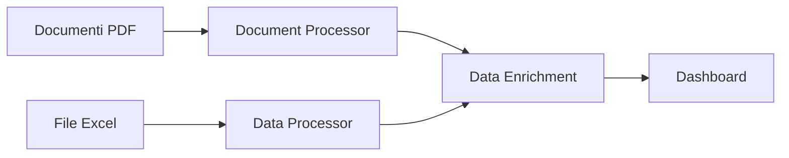

# MIDA - Missioni Internazionali e Dati Analitici

## 👨‍💻 Autore
**Cosimo Melella**

## 📊 Panoramica
MIDA è un sistema di analisi e visualizzazione delle missioni internazionali che combina l'estrazione di dati da documenti PDF con una dashboard interattiva per l'analisi e il monitoraggio delle missioni.

## 🏗️ Struttura del Progetto
```
MIDA/
├── config/
│   └── config.yaml           # Configurazione del sistema
├── data/
│   ├── raw/                  # Dati grezzi
│   │   ├── Excel/           # File Excel originali
│   │   └── PDF/             # Documenti PDF originali
│   ├── documents/           # Documenti PDF processati
│   └── processed/           # Dati elaborati
├── src/
│   ├── main.py              # Script principale
│   ├── document_processor.py # Elaborazione documenti
│   ├── data_processor.py    # Elaborazione dati
│   └── dashboard.py         # Dashboard Streamlit
└── requirements.txt         # Dipendenze Python
```

## 🔄 Flusso dei Dati


## 📁 Struttura dei Dati

### File Excel Principale
Il file Excel contiene le seguenti colonne:
- **Nome Missione**: Identificativo univoco della missione
- **Data Inizio**: Data di inizio della missione
- **Data Fine**: Data di fine della missione
- **Tipo Missione**: Categoria della missione
- **Personale Totale**: Numero di persone coinvolte
- **Costo Totale**: Budget complessivo
- **Mandato**: Obiettivi e finalità
- **Stato**: Stato attuale della missione
- **Note**: Informazioni aggiuntive

### Documenti PDF
I documenti PDF vengono elaborati per estrarre:
- Testo completo
- Date rilevanti
- Informazioni sul personale
- Dettagli finanziari
- Riferimenti normativi

## 📈 Dashboard
La dashboard offre diverse visualizzazioni dei dati:

### 1. Panoramica Missioni

- Numero totale di missioni
- Distribuzione per tipo di missione (grafico a torta)
- Numero di missioni per paese (grafico a barre)

### 2. Dettagli Missioni

- Timeline delle missioni
- Costi per missione (grafico a barre)
- Tabella dettagliata con tutte le informazioni

### 3. Filtri
- Selezione per paese
- Selezione per tipo di missione

## 🚀 Installazione e Utilizzo

1. **Installazione**:
   ```bash
   pip install -r requirements.txt
   ```

2. **Configurazione**:
   ```yaml
   # config/config.yaml
   configurazione:
     excel_path: "data/raw/Excel/Matrice dati 1AGG.xlsx"
     documenti: "data/documents"
     processed_data: "data/processed"
   ```

3. **Elaborazione Dati**:
   ```bash
   python src/main.py
   ```

4. **Avvio Dashboard**:
   ```bash
   python -m streamlit run src/dashboard.py
   ```

## 🛠️ Tecnologie Utilizzate
- **Python**: Linguaggio principale
- **Pandas**: Manipolazione dati
- **PyMuPDF**: Estrazione testo da PDF
- **Streamlit**: Dashboard interattiva
- **Plotly**: Visualizzazioni grafiche

## 📝 Note
- I dati vengono salvati in formato Excel arricchito in `data/processed/`
- La dashboard è accessibile all'indirizzo http://localhost:8501
- I documenti PDF devono essere nella cartella `data/documents/`

## 🔜 Sviluppi Futuri
- [ ] Aggiunta di più tipi di visualizzazioni
- [ ] Implementazione di analisi predittive
- [ ] Integrazione con altre fonti dati
- [ ] Miglioramento dell'estrazione dati dai PDF

## 🐛 Risoluzione Problemi

### Problemi Comuni
1. **Porta 8501 già in uso**:
   ```bash
   # Windows
   netstat -ano | findstr :8501
   taskkill /PID <PID> /F
   
   # Linux/Mac
   lsof -i :8501
   kill -9 <PID>
   ```

2. **Errori di Installazione**:
   ```bash
   pip install --upgrade pip
   pip install -r requirements.txt --no-cache-dir
   ```

3. **Problemi con i PDF**:
   - Verificare che i PDF non siano protetti da password
   - Assicurarsi che i PDF siano in formato testo (non scansione)

## 🤝 Contribuire
1. Fork del repository
2. Creazione branch per feature (`git checkout -b feature/nome-feature`)
3. Commit delle modifiche (`git commit -am 'Aggiunta feature'`)
4. Push del branch (`git push origin feature/nome-feature`)
5. Creazione Pull Request

## 📄 Licenza
Questo progetto è distribuito con licenza MIT. Vedi il file `LICENSE` per maggiori dettagli. 