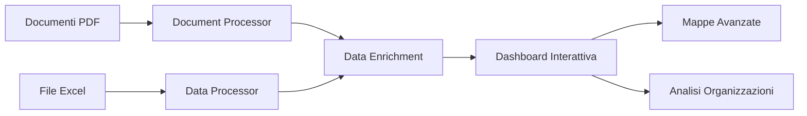

<div align="center">
  <b>Progetto finanziato dall'Unione Europea – NextGenerationEU, Ministero dell'Università e della Ricerca, Italia Domani – PNRR</b>
</div>

# MIDA - Missioni Internazionali e Dati Analitici

## 👨‍💻 Autore
**Cosimo Melella**

## 📊 Panoramica
MIDA è una piattaforma avanzata per l'analisi e la visualizzazione delle missioni internazionali italiane. Il sistema è progettato per accogliere dati da fonti eterogenee (Excel, CSV, PDF) e strutturarli in modo robusto e coerente, garantendo qualità, deduplicazione automatica e analisi interattiva tramite dashboard.

Attualmente il sistema gestisce **~200 missioni** dal **1948 al 2025**, coprendo un arco temporale di oltre 75 anni di impegno internazionale dell'Italia, dalla Guerra Fredda ai giorni nostri.

## 🏗️ Struttura del Progetto
```
MIDA/
├── config/
│   └── config.yaml           # Configurazione del sistema
├── data/
│   ├── raw/                  # Dati grezzi
│   │   ├── Excel/           # File Excel originali
│   │   └── PDF/             # Documenti PDF originali
│   ├── documents/           # Documenti PDF processati
│   └── processed/           # Dati elaborati
│       └── missioni_complete.csv  # Dataset completo aggiornato
├── src/
│   ├── main.py              # Script principale
│   ├── document_processor.py # Elaborazione documenti
│   ├── data_processor.py    # Elaborazione dati
│   ├── missioni_dashboard.py # Dashboard Streamlit principale
│   ├── map_utils.py         # Funzioni per le mappe interattive
│   └── run_dashboard.py     # Script di avvio dashboard
├── docs/
│   ├── images/              # Screenshot e immagini
│   └── missioni_analizzate.md # Documentazione missioni
└── requirements.txt         # Dipendenze Python
```

## 🔄 Flusso dei Dati

```mermaid
graph LR
    A[Documenti PDF] --> B[Document Processor]
    C[File Excel] --> D[Data Processor]
    B --> E[Data Enrichment]
    D --> E
    E --> F[Dashboard Interattiva]
    F --> G[Mappe Avanzate]
    F --> H[Analisi Organizzazioni]
```

## 📁 Struttura dei Dati

### File Principale (`missioni_complete.csv`)
Il dataset strutturato contiene queste colonne obbligatorie:
- **nome**: Nome univoco della missione
- **paese**: Paese di destinazione
- **regione**: Regione geografica
- **sub_regione**: Sub-regione specifica
- **tipo_partecipazione**: (mil, civ, civmil)
- **data_inizio**: Data di inizio (YYYY-MM-DD)
- **data_fine**: Data di fine (YYYY-MM-DD)
- **personale_militare**: Numero personale militare
- **personale_civile**: Numero personale civile
- **personale_totale**: Totale personale
- **costo_totale**: Budget complessivo
- **tipo_missione**: Organizzazione (ONU, UE, NATO, ITA, ecc.)
- **commitment**: Classificazione impegno (calcolata se mancante)

**Nota:** Il sistema accetta anche file Excel con colonne diverse, purché mappabili su queste. La pipeline normalizza e arricchisce i dati automaticamente.

### Documenti PDF
I documenti PDF vengono elaborati per estrarre:
- Testo completo
- Date rilevanti
- Informazioni sul personale
- Dettagli finanziari
- Riferimenti normativi

## 🧹 Pipeline Dati e Deduplicazione
- **Caricamento**: I dati vengono caricati da `data/processed/missioni_complete.csv` e, se presenti, da nuovi file Excel in `data/raw/Excel/`.
- **Normalizzazione**: I dati vengono convertiti nel formato standard, con colonne e tipi coerenti.
- **Deduplicazione automatica**: Missioni con nomi simili (ignorando spazi, trattini, maiuscole/minuscole), stesso paese vengono mantenute una sola volta.
- **Pulizia colonne**: Vengono rimosse colonne duplicate e valori incoerenti.
- **Validazione**: Il sistema segnala missioni con dati mancanti, date incoerenti o costi anomali.

## ➕ Come aggiungere nuovi dati
1. **Aggiungi il file Excel/CSV** in `data/raw/Excel/`.
2. **Assicurati che le colonne siano mappabili** su quelle richieste (vedi sopra). Se usi nomi diversi, la pipeline li mapperà automaticamente se riconoscibili.
3. **Evita duplicati**: la pipeline li rimuove automaticamente, ma è buona pratica controllare che i nomi missione siano coerenti.
4. **Avvia la dashboard**: i dati verranno integrati e puliti automaticamente.

## 🛡️ Qualità e Controlli
- **Script di controllo duplicati**: `python test_check_duplicates.py` segnala missioni simili e anomalie sui costi.
- **Controllo qualità dati**: la dashboard segnala missioni con date o campi chiave mancanti.
- **Best practice**: usa sempre nomi missione chiari e coerenti, verifica i dati prima di aggiungerli.

## 📈 Dashboard Avanzata

### 🎯 Metriche Principali
- **📊 Missioni Totali**: Numero complessivo di missioni
- **👥 Personale Totale**: Somma di tutto il personale impiegato
- **💰 Costo Totale**: Budget complessivo investito
- **🟢 Missioni Attive**: Missioni attualmente in corso

### 📅 Analisi per Periodi Temporali
- **1948-1990**: Guerra Fredda e prime missioni ONU
- **1991-2001**: Post Guerra Fredda
- **2001-2015**: Guerra al Terrorismo  
- **2015-Presente**: Crisi Migratoria e Stabilizzazione

### 🎯 Analisi per Tipo di Partecipazione
- **🎖️ Militare (mil)**: Operazioni di combattimento, training militare
- **👔 Civile (civ)**: Capacity building, assistenza tecnica
- **🎖️👔 Mista (civmil)**: Operazioni di pace, stabilizzazione

### 🏛️ Analisi per Organizzazione
- **🏛️ ONU:** 40+ missioni  
  Esempi: UNTSO (1948), UNIFIL, MINURSO, UNMISS, MONUSCO, UNOCI, UNAMID, MINUSTAH, UNTAET, UNMIK, UNFICYP, ecc.

- **🇪🇺 UE:** 25+ missioni  
  Esempi: EUTM Mali, EUBAM Libya, EUTM Somalia, EUTM RCA, EUCAP Sahel Niger, EUNAVFOR MED, IRINI, EUMM, EUAM Iraq, EULEX Kosovo, EUCAP Somalia, EUAM Ukraine, EUMA Armenia, EUPM Moldova, EUBAM Moldova-Ukraine, EUBAM Rafah, EUPOL COPPS, EUSDI Gulf of Guinea, EUNAVFOR Aspides, ecc.

- **🛡️ NATO:** 10+ missioni  
  Esempi: KFOR, ISAF, IFOR, SFOR, NATO Mission Iraq, Active Endeavour, Resolute Support, ecc.

- **🇮🇹 ITA:** Missioni bilaterali e nazionali  
  Esempi: MISIN, missioni bilaterali in vari paesi

- **Coalizione:** Missioni multinazionali  
  Esempi: MFO, Operation Inherent Resolve, Desert Shield/Storm

![Analisi per Organizzazione]
*Distribuzione delle missioni per organizzazione internazionale*

### 🌍 Analisi per Regione e Sub-Regione
- **Africa**: 25 missioni (Mali, Niger, Somalia, etc.)
- **Europa**: 8 missioni (Balcani, Mediterraneo)
- **Medio Oriente**: 8 missioni (Libano, Iraq, Kuwait)
- **Asia**: 4 missioni (Afghanistan, Timor Est)
- **America**: 5 missioni (Haiti)

## 🗺️ Mappe Interattive Avanzate

### 🌍 Mappa del Mondo

- **Colori per organizzazione**: 🔵 ONU, 🟠 UE, 🟢 NATO, 🔴 ITA
- **Marker intelligenti**: Dimensioni basate sul personale
- **Hover ricchi**: Tutti i dettagli della missione con emoji
- **Legenda integrata**: Visibile e ben posizionata

### 🔥 Mappa di Calore
- **Densità personale**: Visualizzazione della concentrazione di personale
- **Scala colori**: Blu (basso) → Rosso (alto)
- **Radius ottimizzato**: 40px per migliore visualizzazione

### ⏰ Timeline Geografica
- **Slider temporale**: Navigazione anno per anno
- **Evoluzione missioni**: Come si sono sviluppate nel tempo
- **Colori mantenuti**: Organizzazioni sempre distinguibili

### 📍 Mappa Cluster
- **Raggruppamento automatico**: Missioni vicine raggruppate
- **Popup HTML ricchi**: Informazioni complete con styling
- **Layer control**: Attiva/disattiva organizzazioni

### Infografiche e Visualizzazioni

## 🚀 Installazione e Utilizzo

### 1. **Installazione Dipendenze**
```bash
# Dipendenze base
pip install -r requirements.txt

# Dipendenze per le mappe (se non incluse)
pip install folium>=0.14.0 geopandas>=0.12.0 pydeck>=0.8.0 geopy>=2.3.0
```

### 2. **Configurazione**
```yaml
# config/config.yaml
configurazione:
  excel_path: "data/raw/Excel/Matrice dati 1AGG.xlsx"
  documenti: "data/documents"
  processed_data: "data/processed"
```

### 3. **Elaborazione Dati**
```bash
python src/main.py
```

### 4. **Avvio Dashboard**
```bash
# Metodo 1 (consigliato)
python run_dashboard.py

# Metodo 2 (alternativo)
python -m streamlit run src/missioni_dashboard.py
```

### 5. **Accesso Dashboard**
- **URL**: http://localhost:8501
- **Porta**: 8501 (configurabile)

## 🛠️ Tecnologie Utilizzate

### Backend
- **Python 3.11+**: Linguaggio principale
- **Pandas**: Manipolazione e analisi dati
- **NumPy**: Calcoli numerici avanzati

### Frontend & Visualizzazioni
- **Streamlit**: Dashboard interattiva
- **Plotly**: Grafici e mappe interattive
- **Folium**: Mappe geografiche avanzate

### Elaborazione Documenti
- **PyMuPDF**: Estrazione testo da PDF
- **BeautifulSoup**: Parsing HTML
- **httpx**: Download documenti

### Geografia & Mappe
- **Geopandas**: Dati geografici
- **Geopy**: Geocoding e coordinate
- **PyDeck**: Visualizzazioni 3D

## 📊 Funzionalità Dashboard

### 🔍 Filtri Avanzati
- **Anno di inizio**: Dal 1978 al 2025
- **Tipo di partecipazione**: Militare, Civile, Misto
- **Regione**: Africa, Europa, Medio Oriente, Asia, America
- **Tipo missione**: ONU, UE, NATO, ITA
- **Organizzazione**: Filtro specifico per organizzazione

### 📈 Visualizzazioni
- **Grafici a barre**: Missioni per periodo/organizzazione
- **Grafici a torta**: Distribuzione budget e personale
- **Timeline**: Evoluzione temporale delle missioni
- **Tabelle interattive**: Dati completi con formattazione
- **Mappe interattive**: 4 tipi di mappe avanzate

### 📥 Esportazione Dati
- **CSV**: Download dati filtrati
- **Excel**: Export completo con multiple sheet
- **Formattazione**: Valori monetari e numerici formattati

## 📝 Documentazione Missioni

### Tipologie di Missioni Analizzate
- **🏛️ Missioni ONU**: UNIFIL, KFOR, MINURSO, UNMISS, MONUSCO, etc.
- **🇪🇺 Missioni UE**: EUTM Mali/Somalia/RCA, EUCAP Sahel, EUNAVFOR MED, IRINI
- **🛡️ Missioni NATO**: ISAF, IFOR, SFOR
- **🇮🇹 Missioni Italiane**: MISIN (Niger)

### Distribuzione Geografica
- **Africa**: 25 missioni (Mali, Niger, Somalia, Repubblica Centrafricana, etc.)
- **Europa**: 8 missioni (Bosnia, Kosovo, Mediterraneo)
- **Medio Oriente**: 8 missioni (Libano, Iraq, Kuwait)
- **Asia**: 4 missioni (Afghanistan, Timor Est)
- **America**: 5 missioni (Haiti)

## 🔜 Sviluppi Futuri
- [x] ✅ Mappe interattive avanzate
- [x] ✅ Analisi per organizzazione
- [x] ✅ Filtri avanzati
- [x] ✅ Timeline geografica
- [ ] 🔄 Integrazione con API esterne
- [ ] 🔄 Analisi predittive
- [ ] 🔄 Machine Learning per estrazione dati
- [ ] 🔄 Dashboard mobile responsive
- [ ] 🔄 Export PDF dei report
- [ ] 🔄 Notifiche in tempo reale

## 🐛 Risoluzione Problemi

### Problemi Comuni

#### 1. **Porta 8501 già in uso**
```bash
# Windows
netstat -ano | findstr :8501
taskkill /PID <PID> /F

# Linux/Mac
lsof -i :8501
kill -9 <PID>
```

#### 2. **Errori di Installazione**
```bash
pip install --upgrade pip
pip install -r requirements.txt --no-cache-dir
```

#### 3. **Mappe non visibili**
```bash
# Installa dipendenze mappe
pip install folium>=0.14.0 geopandas>=0.12.0 pydeck>=0.8.0 geopy>=2.3.0
```

#### 4. **StreamlitDuplicateElementId**
- ✅ **Risolto**: Tutti i plotly_chart hanno chiavi uniche
- Se persiste, riavvia la dashboard

#### 5. **Problemi con i PDF**
- Verificare che i PDF non siano protetti da password
- Assicurarsi che i PDF siano in formato testo (non scansione)

### Debug Dashboard
- Attiva "🔧 Debug Info" nella sidebar per informazioni tecniche
- Controlla i log nella console per errori dettagliati

## 🤝 Contribuire
1. Fork del repository
2. Creazione branch per feature (`git checkout -b feature/nome-feature`)
3. Commit delle modifiche (`git commit -am 'Aggiunta feature'`)
4. Push del branch (`git push origin feature/nome-feature`)
5. Creazione Pull Request

## 📄 Licenza
Questo progetto è distribuito con licenza MIT. Vedi il file `LICENSE` per maggiori dettagli.

---

## 📸 Screenshots Dashboard

### Panoramica Generale


### Dettagli Missioni


### Mappe Interattive


*Numero di missioni suddivise per tipologia di commitment (Head of Mission, Forze terrestri/navali/aeree, Supporto logistico, ecc.)*

### Infografiche e Visualizzazioni

---

🌍 MIDA - Analisi completa delle missioni internazionali italiane dal 1978 al 2025

📊 Cosa fa questa dashboard
- Analizza **64 missioni internazionali** italiane (dataset aggiornato, senza duplicati o righe vuote)
- Visualizza dati su periodi, personale, costi, regioni, organizzazioni, tipologia di commitment
- Mostra una sezione dettagliata "🔎 Commitment dettagliato per missione" con classificazione:
  - Head of Mission
  - Troops (naval)
  - Troops (air)
  - Troops (ground forces)
  - Troops (logistical support)
- Include una sezione debug in sidebar per vedere tutte le missioni caricate e diagnosticare eventuali problemi

🚀 Come si usa
1. **Avvia la dashboard**:
   ```bash
   python -m streamlit run src/missioni_dashboard.py
   ```
2. **Apri il browser su** [http://localhost:8501](http://localhost:8501)
3. **Controlla la sidebar** per debug e filtri

🗂️ Struttura dati aggiornata
Il file `data/processed/missioni_complete.csv` contiene ora **esattamente 64 missioni** con i seguenti campi principali:
- nome, paese, regione, sub_regione, tipo_partecipazione, data_inizio, data_fine, personale_totale, costo_totale, tipo_missione, commitment
- Ogni missione è unica (es. UNMISS è presente una sola volta)
- Commitment classificato secondo la tabella fornita dall'utente
- Nessuna riga vuota o missione senza nome

🆕 Novità principali
- **Dataset pulito e coerente** con la tabella fornita
- **Commitment dettagliato** per ogni missione, con override per UNIFIL e logica di mapping custom
- **Sezione debug** sempre visibile in sidebar
- **Banner di sponsorship** visibile anche su GitHub

📈 Grafici e analisi
- Analisi per periodo, personale, costi, regione, organizzazione
- Grafici e tabella per commitment dettagliato
- Tutti i filtri e le mappe aggiornati al nuovo dataset

🛠️ Debug e supporto
- Se il numero di missioni caricate non è 64, controlla la sezione debug in sidebar e usa lo script `scripts/clean_missioni_csv.py` per pulire il file
- Per integrare nuovi dati, aggiungi le missioni al CSV seguendo la struttura e poi lancia lo script di pulizia
- Per problemi o richieste, apri una issue o contatta il maintainer

---

> Ultimo aggiornamento: luglio 2025 

---

**Progetto sviluppato presso l'Università degli Studi di Catania**  
 

## 🐞 Debug e raccomandazioni sulle date

- Le colonne `data_inizio` e `data_fine` devono essere sempre in formato `YYYY-MM-DD` (esempio: 2024-07-02).
- La dashboard forza la conversione automatica delle date e segnala nella sidebar quante missioni hanno date non valide.
- Se vedi missioni mancanti nelle analisi temporali, controlla che tutte le date siano corrette e senza valori vuoti.
- In caso di errore, correggi il file CSV e ricarica la dashboard.