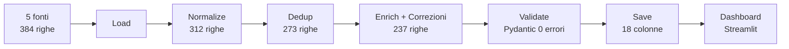

<p align="center">
  <a href="https://www.difesa.it/operazionimilitari/">
    
  </a>
</p>
<p align="center">
  <em>Progetto finanziato dall'Unione Europea – NextGenerationEU, Ministero dell'Università e della Ricerca, Italia Domani – PNRR</em>
</p>

<p align="center">
  
  <br/>
  <b>Progetto sviluppato presso l'Università di Catania</b>
</p>

<br/>

<div align="center">
  <h1>MIDA — Missioni Internazionali e Dati Analitici</h1>
  <p><b>Piattaforma di analisi delle missioni internazionali italiane (1948-2026)</b></p>

  
  
  
  
  -4A5D23?style=flat-square)
</div>

---

## Autore

**Cosimo Melella** — Università di Catania

## Panoramica

MIDA aggrega dati da **5 fonti** (CSV + 4 file Excel), producendo un dataset unificato di **237 missioni** dopo deduplicazione automatica, correzione dati vs fonti ufficiali ([difesa.it](https://www.difesa.it/operazionimilitari/)) e validazione Pydantic.

| Metrica | Valore |
|---------|--------|
| Fonti aggregate | 5 (384 righe raw) |
| Missioni dopo pipeline | **237** |
| Missioni attive (2026) | **39** (verificate vs difesa.it) |
| Personale totale | ~8.800 unità |
| Paesi coinvolti | 75 |
| Missioni con data | **237/237** (0 mancanti) |
| Errori validazione | 0 |
| Test | 188 passing |

## Avvio Rapido

```bash
# Installa dipendenze
pip install -r requirements.txt

# Rigenera il dataset
python -m core.aggregator

# Avvia la dashboard
streamlit run dashboard/app.py

# Esegui i test
python -m pytest tests/ -v
```

Dashboard disponibile su **http://localhost:8501**

## Struttura del Progetto

```
MIDA/
├── .github/workflows/       # CI/CD GitHub Actions
├── .streamlit/config.toml   # Tema militare italiano
├── config/
│   └── sources.yaml         # Registry fonti dati con mapping colonne
├── core/
│   ├── models.py            # Modelli Pydantic (Mission, SourceConfig, PipelineResult)
│   ├── normalizer.py        # Normalizzazioni (nomi, org, regioni, commitment)
│   ├── aggregator.py        # Pipeline: load → normalize → dedup → enrich → validate → save
│   ├── scrapers/            # Web scrapers (difesa, camera, senato, NATO, ONU, UE, esteri)
│   └── pdf_extractor/       # Estrazione documenti PDF/DOCX
├── dashboard/
│   ├── app.py               # Entry point + tema CSS militare
│   ├── data_loader.py       # Caricamento dati con cache Streamlit
│   ├── filters.py           # Filtri sidebar
│   ├── charts.py            # Grafici Plotly con palette militare
│   ├── analysis.py          # Funzioni analitiche
│   ├── pdf_report.py        # Generatore report PDF (fpdf2)
│   ├── views/               # Pagine modulari
│   │   ├── overview.py      #   KPI + grafici panoramica
│   │   ├── missions.py      #   Tabella missioni + export CSV/Excel/PDF
│   │   ├── timeline.py      #   Timeline interattive
│   │   └── maps_page.py     #   5 tab mappe (Attive, Mondo, Calore, Timeline, Cluster)
│   └── maps/                # Componenti Folium
│       ├── active_missions_map.py
│       ├── world_map.py
│       ├── heatmap.py
│       ├── timeline_map.py
│       ├── cluster_map.py
│       └── geocoding.py     # 200+ coordinate paesi
├── data/
│   ├── raw/                 # Fonti Excel/CSV originali
│   └── processed/           # missioni_complete.csv (output pipeline)
├── tests/
│   ├── test_normalizer.py   # 51 test
│   ├── test_models.py       # 21 test
│   ├── test_aggregator.py   # 12 test
│   ├── test_scrapers.py     # Test scrapers
│   ├── test_dashboard.py    # Test dashboard
│   └── test_commitment_dashboard.py
├── docs/images/             # Banner istituzionali
├── requirements.txt
└── README.md
```

## Pipeline Dati (v3.3)


```mermaid
graph LR
    A[5 fonti<br/>384 righe] --> B[Load]
    B --> C[Normalize<br/>312 righe]
    C --> D[Dedup<br/>273 righe]
    D --> E[Enrich + Correzioni<br/>237 righe]
    E --> F[Validate<br/>Pydantic 0 errori]
    F --> G[Save<br/>18 colonne]
    G --> H[Dashboard<br/>Streamlit]
```

### Step della pipeline

1. **Load** — Carica fonti da `config/sources.yaml`, applica mapping colonne
2. **Normalize** — Nomi missione, organizzazioni (ONU/NATO/UE), regioni (6 macro), commitment
3. **Dedup** — Chiave = nome normalizzato strict. Vince la fonte con più dati
4. **Enrich** — Correzioni ufficiali difesa.it (nomi, paesi, personale, costi), cross-reference 38 missioni attive, iniezione missioni mancanti
5. **Validate** — Ogni record passa per il modello Pydantic `Mission`
6. **Save** — 18 colonne canoniche in `data/processed/missioni_complete.csv`

### Colonne del dataset

| Colonna | Tipo | Descrizione |
|---------|------|-------------|
| `nome` | str | Nome univoco missione |
| `paese` | str | Paese (normalizzato IT) |
| `regione` | str | Africa, Europa, Medio Oriente, Asia, America |
| `tipo_missione` | str | ONU, NATO, UE, ITA, Bilateral, Multinational, Coalizione |
| `commitment` | str | Troops, Head of Mission, Advisory/Training, ecc. |
| `data_inizio` / `data_fine` | date | Periodo missione |
| `personale_militare` / `civile` / `totale` | float | Personale impiegato |
| `costo_totale` | float | Costo in euro (quota italiana) |
| `is_active` | bool | Attiva nel 2026 (verificata vs difesa.it) |

## Dashboard

### Pagine

- **Panoramica** — 8 KPI card, grafici per periodo/organizzazione/regione, distribuzione personale e costi
- **Missioni e Dati** — Tabella interattiva completa, export CSV filtrato
- **Timeline** — Timeline per organizzazione, regione, durata; scatter interattivo con slider temporale
- **Mappe** — 5 tab: Missioni Attive 2026, Mappa Mondo, Calore, Timeline Geografica, Cluster

### Tema visivo

Palette militare italiana: verde oliva, blu marina, sabbia, rosso esercito, grigio acciaio. Sidebar scura con dropdown leggibili, KPI con accenti colorati, grafici Plotly con colori coerenti. **Dark mode** attivabile dal toggle nella sidebar.

### Export

- **CSV** — Dataset filtrato
- **Excel** — Multi-sheet (Missioni, Organizzazioni, Commitment, Regioni)
- **PDF** — Report sintetico con KPI, distribuzione org/regione, missioni attive, top 10 personale

### Filtri

- Anno di inizio (periodi storici)
- Tipo partecipazione (mil/civ/civmil)
- Regione
- Organizzazione
- Tipo commitment

## Test

```bash
# Tutti i test
python -m pytest tests/ -v

# Solo normalizer (51 test)
python -m pytest tests/test_normalizer.py -v

# Solo modelli (21 test)
python -m pytest tests/test_models.py -v

# Solo pipeline (12 test)
python -m pytest tests/test_aggregator.py -v
```

## Tecnologie

| Categoria | Tecnologie |
|-----------|------------|
| **Core** | Python 3.11+, Pandas, NumPy, Pydantic |
| **Dashboard** | Streamlit, Plotly, Folium |
| **Test** | pytest (188 test) |
| **Scraping** | requests, BeautifulSoup, lxml |
| **Documenti** | PyMuPDF, python-docx |

## Fonti Dati

| Fonte | Tipo | Contenuto |
|-------|------|----------|
| [difesa.it](https://www.difesa.it/operazionimilitari/) | Scraper + manuale | Missioni in corso, personale, costi |
| [analisidifesa.it](https://www.analisidifesa.it/) | Manuale | Analisi annuali missioni, dati Delibera CdM |
| [Camera dei Deputati](https://www.camera.it/) | Scraper | Delibere missioni internazionali |
| [Senato](https://www.senato.it/) | Scraper | Documenti parlamentari |
| [EEAS (UE)](https://www.eeas.europa.eu/) | Scraper | Missioni CSDP civili e militari |
| [NATO](https://www.nato.int/) | Scraper | Operazioni e missioni NATO |
| [ONU](https://peacekeeping.un.org/) | Scraper | Peacekeeping operations |

## Come aggiungere dati

1. Aggiungi il file Excel/CSV in `data/raw/Excel/`
2. Registra la fonte in `config/sources.yaml` con il mapping colonne
3. Esegui `python -m core.aggregator` — la pipeline normalizza, deduplica e valida automaticamente
4. Avvia `streamlit run dashboard/app.py` per visualizzare

## Contribuire

1. Fork del repository
2. `git checkout -b feature/nome-feature`
3. `git commit -am 'Aggiunta feature'`
4. `git push origin feature/nome-feature`
5. Pull Request

## Licenza

Distribuito con licenza MIT.

---

<div align="center">
  <sub>MIDA — Missioni Internazionali e Dati Analitici &middot; Università di Catania &middot; Dati: <a href="https://www.difesa.it/operazionimilitari/">Ministero della Difesa</a></sub>
</div>