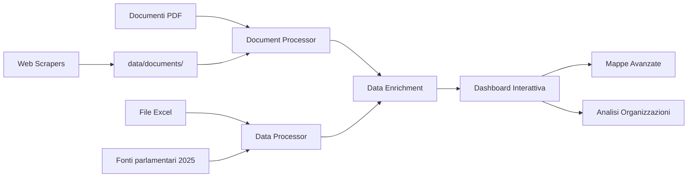
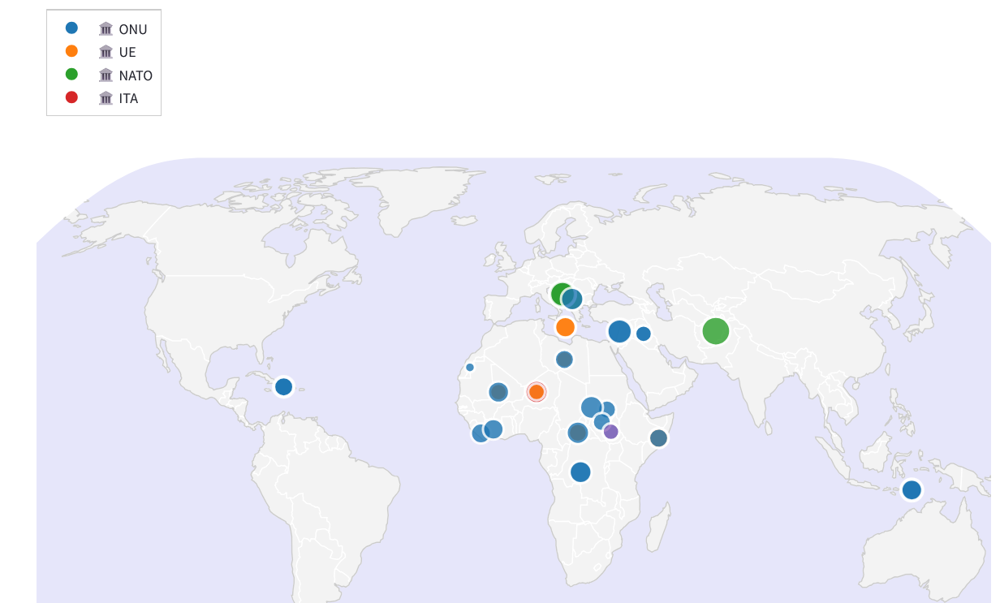
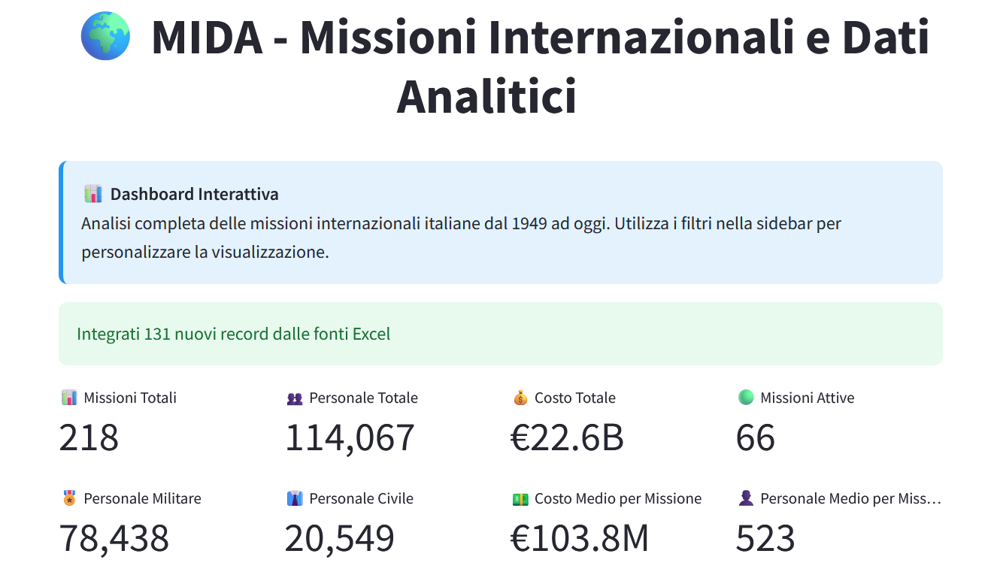
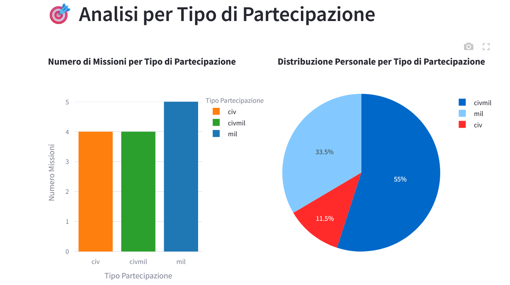
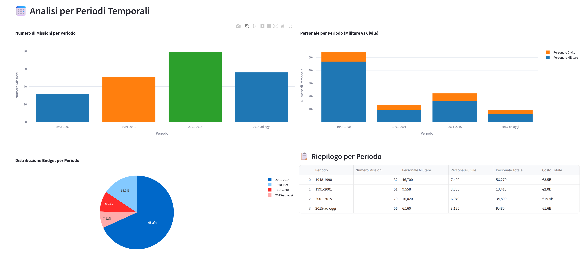
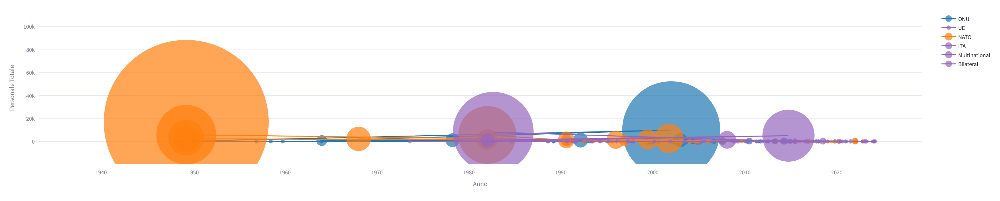
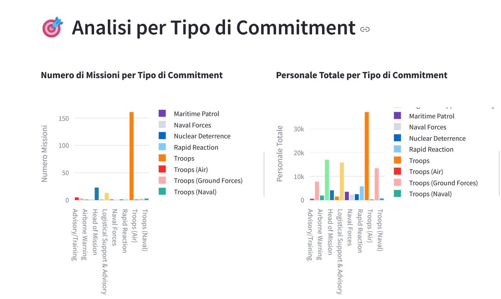

<div align="center">
  <b>Progetto finanziato dall'Unione Europea – NextGenerationEU, Ministero dell'Università e della Ricerca, Italia Domani – PNRR</b>
</div>

<div align="center">
  
  <br/>
  <b>Progetto sviluppato presso l'Università di Catania</b>
</div>

# MIDA - Missioni Internazionali e Dati Analitici

## 👨‍💻 Autore
**Cosimo Melella** - Università di Catania

## 📊 Panoramica
MIDA è una piattaforma avanzata per l'analisi e la visualizzazione delle missioni internazionali italiane. Il sistema è progettato per accogliere dati da fonti eterogenee (Excel, CSV, PDF, dati parlamentari) e strutturarli in modo robusto e coerente, garantendo qualità, deduplicazione automatica e analisi interattiva tramite dashboard.

Attualmente il sistema gestisce **208 missioni uniche** nel dataset principale, con **218 missioni** nella dashboard grazie all'integrazione automatica con fonti aggiuntive, dal **1949 al 2027**, coprendo un arco temporale di **78 anni** di impegno internazionale dell'Italia, dalla Guerra Fredda ai giorni nostri.

## 🏗️ Struttura del Progetto
```
MIDA/
├── config/
│   └── config.yaml           # Configurazione del sistema
├── data/
│   ├── raw/                  # Dati grezzi (Excel, PDF, JSON)
│   ├── documents/            # Documenti PDF/DOCX centralizzati
│   ├── processed/            # Dati elaborati intermedi
│   └── final/                # Output finali (CSV, XLSX)
├── core/
│   ├── scrapers/             # Web scrapers e document collectors
│   │   ├── smart_document_fetcher.py
│   │   ├── sitemap_document_collector.py
│   │   ├── european_document_collector.py
│   │   ├── document_collector.py
│   │   ├── camera_scraper.py
│   │   ├── document_scraper.py
│   │   ├── web_scraper.py
│   │   └── altri scrapers...
│   ├── pdf_extractor/        # Sistema di estrazione e analisi documenti
│   │   ├── data_extractor.py
│   │   ├── pdf_parser.py
│   │   ├── docx_parser.py
│   │   ├── report_generator.py
│   │   ├── web_interface/    # Interfaccia web Flask
│   │   │   ├── app.py
│   │   │   └── templates/
│   │   ├── run_pdf_extractor.py
│   │   ├── run_fast_extractor.py
│   │   ├── run_ultra_fast_extractor.py
│   │   └── run_document_extractor.py
│   ├── processors/           # Processamento e normalizzazione dati
│   ├── validators/           # Validazione dati
│   ├── mergers/              # Unione dati da fonti diverse
│   ├── classifiers/          # Classificazione missioni
│   ├── utils/                # Utility condivise
│   └── main.py               # Script principale di orchestrazione
├── dashboard/
│   ├── missioni_dashboard.py # Dashboard Streamlit principale
│   ├── maps/                 # Componenti mappe avanzate
│   │   ├── advanced_maps.py
│   │   └── geocoding.py
│   └── altri file dashboard  # Componenti e utility dashboard
├── tests/                    # Test automatici e script di verifica
│   ├── test_scrapers_update.py
│   ├── test_extraction.py
│   ├── benchmark_performance.py
│   ├── quick_test.py
│   └── altri test...
├── reports/
│   └── report_generator.py   # Generazione report e template
├── utils/
│   └── notification_system.py, map_utils.py, ecc.
├── docs/
│   └── images/, missioni_analizzate.md, ecc.
├── requirements.txt
├── run_dashboard.py
└── README.md
```

## 🚀 Avvio Dashboard

#### Metodo 1 (Consigliato)
```bash
python run_dashboard.py
```

#### Metodo 2 (Alternativo)
```bash
python -m streamlit run dashboard/missioni_dashboard.py
```

### 🌐 Accesso Dashboard
- **URL**: http://localhost:8501
- **Porta**: 8501 (configurabile)
- **Browser**: Apri il link nel tuo browser preferito

### 🔄 Ricaricamento Dati
- **Pulsante "🔄 Ricarica Dati"** nella sidebar per forzare l'aggiornamento
- **Cache automatica**: I dati si aggiornano ogni 60 secondi
- **Debug info**: Controlla la sidebar per informazioni tecniche

## 📄 Sistema di Estrazione Documenti

### 🚀 Avvio PDF Extractor

#### Modalità Completa (con NLP)
```bash
python core/pdf_extractor/run_pdf_extractor.py
```

#### Modalità Veloce (spaCy disabilitato)
```bash
python core/pdf_extractor/run_fast_extractor.py
```

#### Modalità Ultra-Veloce (solo estrazione testo)
```bash
python core/pdf_extractor/run_ultra_fast_extractor.py
```

### 🌐 Accesso Interfaccia Web
- **URL**: http://localhost:5000
- **Porta**: 5000 (separata dalla dashboard Streamlit)
- **Funzionalità**:
  - Upload singolo file PDF/DOCX
  - Estrazione testo con preview
  - Analisi NLP con spaCy
  - Visualizzazione risultati strutturati
  - Gestione file nella cartella centralizzata

### 📁 Cartella Centralizzata
Tutti i documenti PDF e DOCX vengono salvati automaticamente in:
```
data/documents/
```

## 🕷️ Sistema Web Scraping

### 📥 Download Automatico Documenti
Il sistema include web scrapers specializzati per scaricare documenti da:

- **Siti istituzionali italiani** (Camera, Senato, Governo)
- **Siti europei** (UE, NATO)
- **Sitemap XML** di siti istituzionali
- **Documenti parlamentari** e relazioni

### 🔧 Configurazione Scrapers
I scrapers sono configurati in `config/config.yaml` con:
- Timeout e retry automatici
- User-Agent personalizzati
- Gestione errori robusta
- Salvataggio centralizzato in `data/documents/`

### 🧪 Test Scrapers
```bash
python tests/test_scrapers_update.py
```

## 🔄 Flusso dei Dati

```mermaid
graph LR
    A[Documenti PDF] --> B[Document Processor]
    C[File Excel] --> D[Data Processor]
    E[Fonti parlamentari 2025] --> D
    F[Web Scrapers] --> G[data/documents/]
    G --> B
    B --> H[Data Enrichment]
    D --> H
    H --> I[Dashboard Interattiva]
    I --> J[Mappe Avanzate]
    I --> K[Analisi Organizzazioni]
```

## 📁 Struttura dei Dati

### File Principale (`missioni_complete.csv`)
Il dataset strutturato contiene queste colonne obbligatorie:
- **nome**: Nome univoco della missione
- **paese**: Paese di destinazione
- **regione**: Regione geografica
- **sub_regione**: Sub-regione specifica
- **tipo_partecipazione**: (mil, civ, civmil)
- **data_inizio**: Data di inizio (YYYY-MM-DD)
- **data_fine**: Data di fine (YYYY-MM-DD)
- **personale_militare**: Numero personale militare
- **personale_civile**: Numero personale civile
- **personale_totale**: Totale personale
- **costo_totale**: Budget complessivo
- **tipo_missione**: Organizzazione (ONU, UE, NATO, ITA, ecc.)
- **commitment**: Classificazione impegno (calcolata se mancante)

**Nota:** Il sistema accetta anche file Excel con colonne diverse, purché mappabili su queste. La pipeline normalizza e arricchisce i dati automaticamente.

### Documenti PDF
I documenti PDF vengono elaborati per estrarre:
- Testo completo
- Date rilevanti
- Informazioni sul personale
- Dettagli finanziari
- Riferimenti normativi

## 🧹 Pipeline Dati e Deduplicazione
- **Caricamento**: I dati vengono caricati da `data/processed/missioni_complete.csv` e, se presenti, da nuovi file Excel in `data/raw/Excel/` e dalle fonti parlamentari 2025.
- **Normalizzazione**: I dati vengono convertiti nel formato standard, con colonne e tipi coerenti.
- **Deduplicazione automatica**: Missioni con nomi simili (ignorando spazi, trattini, maiuscole/minuscole), stesso paese vengono mantenute una sola volta.
- **Pulizia colonne**: Vengono rimosse colonne duplicate e valori incoerenti.
- **Validazione**: Il sistema segnala missioni con dati mancanti, date incoerenti o costi anomali.

## 📊 Conteggio Missioni: 208 vs 218

Il sistema gestisce due conteggi diversi:

### Dataset Principale (208 missioni)
- **File**: `data/processed/missioni_complete.csv`
- **Contenuto**: Missioni principali con dati completi e dettagliati
- **Uso**: Dataset pulito e validato per analisi approfondite

### Dashboard (218 missioni)
- **Fonte**: Integrazione automatica del dataset principale + file Excel aggiuntivi
- **Processo**: 
  1. Carica 208 missioni dal dataset principale
  2. Integra automaticamente `data/raw/Excel/missions.xlsx`
  3. Rimuove duplicati usando `str.contains()` per il confronto
  4. Risultato: 218 missioni uniche
- **Vantaggio**: Dataset più completo con missioni aggiuntive

### Missioni Aggiunte dalla Dashboard
La dashboard aggiunge automaticamente 16 missioni dal file Excel, ma rimuove 6 missioni durante la deduplicazione finale:
- Joint Forge (SFOR) (NATO)
- UNMIBH (IPTF) (UN)
- UNSOM (UN)
- EUTM Mozambico (EU)
- Enhanced Vigilance Activity Bulgaria (NATO)
- Enhanced Vigilance Activity Hungary (NATO)
- VJTF NATO (NATO)
- Qatar World Cup (Bilateral)
- TFA-R Gladiator Romania (NATO)
- EUMAM Ukraine (EU)
- EUMPM Niger (EU)
- EMASoH (EU)
- EUNAVFOR - Aspides (EU)
- Combined Task Force 153 (Multinational)
- Operazione Levante (Bilateral)
- Bilateral mission in Burkina Faso (Bilateral)

**Calcolo finale**: 208 (file principale) + 16 (aggiunte) - 6 (rimosse) = 218 missioni

**Entrambi i conteggi sono corretti** per il loro scopo specifico.

## ➕ Come aggiungere nuovi dati
1. **Aggiungi il file Excel/CSV** in `data/raw/Excel/`.
2. **Assicurati che le colonne siano mappabili** su quelle richieste (vedi sopra). Se usi nomi diversi, la pipeline li mapperà automaticamente se riconoscibili.
3. **Evita duplicati**: la pipeline li rimuove automaticamente, ma è buona pratica controllare che i nomi missione siano coerenti.
4. **Avvia la dashboard**: i dati verranno integrati e puliti automaticamente.

## 🛡️ Qualità e Controlli
- **Script di controllo duplicati**: `python test_check_duplicates.py` segnala missioni simili e anomalie sui costi.
- **Controllo qualità dati**: la dashboard segnala missioni con date o campi chiave mancanti.
- **Best practice**: usa sempre nomi missione chiari e coerenti, verifica i dati prima di aggiungerli.

## 📈 Dashboard Avanzata

### 🎯 Metriche Principali
- **📊 Missioni Totali**: Numero complessivo di missioni (**218 nella dashboard, 208 nel dataset principale**)
- **👥 Personale Totale**: Somma di tutto il personale impiegato
- **💰 Costo Totale**: Budget complessivo investito
- **🟢 Missioni Attive**: Missioni attualmente in corso

### 📅 Analisi per Periodi Temporali
- **1949-1990**: Guerra Fredda e prime missioni ONU
- **1991-2001**: Post Guerra Fredda
- **2001-2015**: Guerra al Terrorismo  
- **2015-Presente**: Crisi Migratoria e Stabilizzazione

### 🎯 Analisi per Tipo di Partecipazione
- **🎖️ Militare (mil)**: Operazioni di combattimento, training militare
- **👔 Civile (civ)**: Capacity building, assistenza tecnica
- **🎖️👔 Mista (civmil)**: Operazioni di pace, stabilizzazione

### 🏛️ Analisi per Organizzazione
- **🏛️ ONU:** 60 missioni  
  Esempi: UNIFIL, MINURSO, UNMISS, UNPROFOR, UNMIK, MONUSCO, UNOCI, UNAMID, MINUSTAH, UNTAET, UNFICYP, ecc.
- **🏛️ NATO:** 60 missioni  
  Esempi: KFOR, ISAF, IFOR, SFOR, NATO Mission Iraq, Enhanced Vigilance Activities, Forward Land Forces, Sea Guardian, Air Policing, ecc.
- **🇪🇺 UE:** 51 missioni  
  Esempi: EUTM Mali, EUBAM Libya, EUFOR ALTHEA, EUTM Somalia, EUTM RCA, EUNAVFOR ATALANTA, IRINI, EUMM, EUAM Iraq, EULEX Kosovo, EUCAP Somalia, EUAM Ukraine, EUMA Armenia, EUPM Moldova, EUBAM Moldova-Ukraine, EUBAM Rafah, EUPOL COPPS, EUSDI Gulf of Guinea, EUNAVFOR Aspides, MPCC UE, CRRTs UE, ecc.
- **🤝 Bilateral:** 28 missioni  
  Esempi: MIBIL, MIADIT, MIASIT, Cooperazione tecnica Angola, ecc.
- **🤝 Multinational:** 18 missioni  
  Esempi: (vedi dashboard per elenco completo)
- **🇮🇹 ITA:** 1 missione  
  Esempi: MISIN

*Distribuzione delle missioni per organizzazione internazionale*

### 🌍 Analisi per Regione e Sub-Regione
- **Africa**: 57 missioni (MONUSCO, MINURSO, MINUSCA, EUTM Mali, MINUSMA, ecc.)
- **Medio Oriente**: 39 missioni (UNIFIL, MIBIL, MIADIT, UNSMIL, EUAM Iraq, Operation Inherent Resolve, ecc.)
- **Balkans**: 32 missioni (KFOR, EUFOR ALTHEA, IFOR, SFOR, EULEX Kosovo, ecc.)
- **Europa**: 27 missioni (EUBAM Moldova-Ukraine, EUPM Moldova, ecc.)
- **Rest of Europe**: 22 missioni (EUMM Georgia, MPCC UE, ecc.)
- **Asia**: 14 missioni (ISAF, UNAMA, UNTAET, ecc.)
- **Northern Africa and Meditterranean**: 13 missioni (EUBAM Libya, MIASIT, ecc.)
- **America**: 10 missioni (MINUSTAH, MINUJUSTH, BINUH, MIPONUH, UNTMIH, ecc.)
- **Eurasia**: 2 missioni (EUMA Armenia, ecc.)
- **Mediterraneo**: 1 missione (IRINI)
- **Africa/Asia**: 1 missione (EUNAVFOR Aspides)

---

### 🆕 Note aggiornate

- **Copertura temporale:** la dashboard ora copre missioni dal 1949 al 2027, incluse tutte le missioni attive e pianificate per il 2025 secondo i dati parlamentari più recenti, con alcune missioni UE estese fino al 2027 (EUCAP Somalia, EUMA Armenia).
- **Nuove missioni 2025:** integrate e visibili nella dashboard (es. EUFOR ALTHEA, Enhanced Vigilance Activities, Forward Land Forces, Sea Guardian, Air Policing, MPCC UE, CRRTs UE, ecc.).
- **Missioni estese:** alcune missioni UE sono state estese oltre il 2025 per riflettere gli impegni a lungo termine.
- **Deduplicazione e qualità:** il dataset è stato deduplicato e validato, senza anomalie o doppioni.

## 🗺️ Mappe Interattive Avanzate

### 🌍 Mappa del Mondo

- **Colori per organizzazione**: 
  - 🔵 **ONU** (60 missioni): UNIFIL, MINURSO, UNMISS, UNPROFOR, UNMIK, MONUSCO, UNOCI, UNAMID, MINUSTAH, UNTAET, UNFICYP, ecc.
  - 🟢 **NATO** (60 missioni): KFOR, ISAF, IFOR, SFOR, NATO Mission Iraq, Enhanced Vigilance Activities, Forward Land Forces, Sea Guardian, Air Policing, ecc.
  - 🟠 **UE** (51 missioni): EUTM Mali, EUBAM Libya, EUFOR ALTHEA, EUTM Somalia, EUTM RCA, EUNAVFOR ATALANTA, IRINI, EUMM, EUAM Iraq, EULEX Kosovo, EUCAP Somalia, EUAM Ukraine, EUMA Armenia, EUPM Moldova, EUBAM Moldova-Ukraine, EUBAM Rafah, EUPOL COPPS, EUSDI Gulf of Guinea, EUNAVFOR Aspides, MPCC UE, CRRTs UE, ecc.
  - 🟡 **Bilateral** (28 missioni): MIBIL, MIADIT, MIASIT, Cooperazione tecnica Angola, ecc.
  - 🟣 **Multinational** (18 missioni): Combined Task Force 153, ecc.
  - 🔴 **ITA** (1 missione): MISIN
- **Marker intelligenti**: Dimensioni basate sul personale
- **Hover ricchi**: Tutti i dettagli della missione con emoji
- **Legenda integrata**: Visibile e ben posizionata

### 🔥 Mappa di Calore
- **Densità personale**: Visualizzazione della concentrazione di personale
- **Scala colori**: Blu (basso) → Rosso (alto)
- **Radius ottimizzato**: 40px per migliore visualizzazione
- **Organizzazioni**: Tutte le 6 organizzazioni rappresentate con distribuzione aggiornata:
  - **ONU**: 60 missioni (27.5%)
  - **NATO**: 60 missioni (27.5%)
  - **UE**: 51 missioni (23.4%)
  - **Bilateral**: 28 missioni (12.8%)
  - **Multinational**: 18 missioni (8.3%)
  - **ITA**: 1 missione (0.5%)

### ⏰ Timeline Geografica
- **Slider temporale**: Navigazione anno per anno dal 1949 al 2027
- **Evoluzione missioni**: Come si sono sviluppate nel tempo attraverso 78 anni di impegno internazionale
- **Colori mantenuti**: Organizzazioni sempre distinguibili con la stessa palette colori:
  - 🔵 ONU, 🟢 NATO, 🟠 UE, 🟡 Bilateral, 🟣 Multinational, 🔴 ITA

### 📍 Mappa Cluster
- **Raggruppamento automatico**: Missioni vicine raggruppate per ottimizzare la visualizzazione
- **Popup HTML ricchi**: Informazioni complete con styling e dettagli per ogni missione
- **Layer control**: Attiva/disattiva organizzazioni individualmente per analisi mirate:
  - ONU (60 missioni)
  - NATO (60 missioni) 
  - UE (51 missioni)
  - Bilateral (28 missioni)
  - Multinational (18 missioni)
  - ITA (1 missione)

## 🚀 Installazione e Utilizzo

### 📋 Prerequisiti
- **Python 3.11+** installato
- **Git** per clonare il repository
- **Browser web** moderno

### 🔧 Installazione Dipendenze

#### Windows
```powershell
# Installa Python (se non già installato)
# Scarica da https://www.python.org/downloads/

# Clona il repository
git clone https://github.com/username/MIDA-Missioni-Internazionali-e-Dati-Analitici.git
cd MIDA-Missioni-Internazionali-e-Dati-Analitici

# Crea ambiente virtuale (opzionale ma consigliato)
python -m venv venv
venv\Scripts\activate

# Installa dipendenze
pip install -r requirements.txt

# Dipendenze aggiuntive per le mappe
pip install folium>=0.14.0 geopandas>=0.12.0 pydeck>=0.8.0 geopy>=2.3.0
```

#### Linux/macOS
```bash
# Installa Python (se non già installato)
# Ubuntu/Debian: sudo apt install python3 python3-pip
# macOS: brew install python3

# Clona il repository
git clone https://github.com/username/MIDA-Missioni-Internazionali-e-Dati-Analitici.git
cd MIDA-Missioni-Internazionali-e-Dati-Analitici

# Crea ambiente virtuale (opzionale ma consigliato)
python3 -m venv venv
source venv/bin/activate

# Installa dipendenze
pip install -r requirements.txt

# Dipendenze aggiuntive per le mappe
pip install folium>=0.14.0 geopandas>=0.12.0 pydeck>=0.8.0 geopy>=2.3.0
```

### ⚙️ Configurazione
```yaml
# config/config.yaml
configurazione:
  excel_path: "data/raw/Excel/Matrice dati 1AGG.xlsx"
  documenti: "data/documents"
  processed_data: "data/processed"
```

## 🚀 Avvio Dashboard

#### Metodo 1 (Consigliato)
```bash
python run_dashboard.py
```

#### Metodo 2 (Alternativo)
```bash
python -m streamlit run dashboard/missioni_dashboard.py
```

### 🌐 Accesso Dashboard
- **URL**: http://localhost:8501
- **Porta**: 8501 (configurabile)
- **Browser**: Apri il link nel tuo browser preferito

### 🔄 Ricaricamento Dati
- **Pulsante "🔄 Ricarica Dati"** nella sidebar per forzare l'aggiornamento
- **Cache automatica**: I dati si aggiornano ogni 60 secondi
- **Debug info**: Controlla la sidebar per informazioni tecniche

## 📄 Sistema di Estrazione Documenti

### 🚀 Avvio PDF Extractor

#### Modalità Completa (con NLP)
```bash
python core/pdf_extractor/run_pdf_extractor.py
```

#### Modalità Veloce (spaCy disabilitato)
```bash
python core/pdf_extractor/run_fast_extractor.py
```

#### Modalità Ultra Veloce (solo estrazione testo)
```bash
python core/pdf_extractor/run_ultra_fast_extractor.py
```

### 🌐 Accesso Interfaccia Web
- **URL**: http://localhost:5000
- **Porta**: 5000
- **Funzionalità**:
  - Upload singoli file PDF/DOCX
  - Estrazione testo con preview
  - Analisi NLP con entità e pattern
  - Gestione file centralizzata in `data/documents/`

### 📁 Gestione Documenti
- **Cartella centralizzata**: `data/documents/`
- **Formati supportati**: PDF, DOCX
- **Deduplicazione automatica**: File con nomi simili vengono gestiti
- **Metadati**: Ogni documento mantiene informazioni su fonte e download

## 🕷️ Web Scrapers

### 🧪 Test Configurazione
```bash
python tests/test_scrapers_update.py
```

### 📋 Scrapers Disponibili
- **SmartDocumentFetcher**: Scraping intelligente con gestione errori
- **SitemapDocumentCollector**: Raccolta da sitemap.xml
- **EuropeanDocumentCollector**: Documenti istituzionali europei
- **DocumentCollector**: Documenti PDF/DOCX generici
- **CameraScraper**: Documenti Camera dei Deputati
- **WebScraper**: Scraping generico con download documenti

### 🔄 Flusso Integrato
1. **Web Scrapers** scaricano documenti in `data/documents/`
2. **PDF Extractor** processa i documenti scaricati
3. **Dashboard** visualizza i risultati dell'analisi
4. **Sistema unificato** per gestione documenti

### ⚙️ Configurazione Scrapers
Tutti gli scrapers sono configurati per:
- Salvare documenti in `data/documents/`
- Generare nomi file descrittivi
- Evitare duplicati automaticamente
- Mantenere metadati di download

## 🛠️ Tecnologie Utilizzate

### Backend
- **Python 3.11+**: Linguaggio principale
- **Pandas**: Manipolazione e analisi dati
- **NumPy**: Calcoli numerici avanzati

### Frontend & Visualizzazioni
- **Streamlit**: Dashboard interattiva
- **Plotly**: Grafici e mappe interattive
- **Folium**: Mappe geografiche avanzate

### Elaborazione Documenti
- **PyMuPDF**: Estrazione testo da PDF
- **python-docx**: Estrazione testo da DOCX
- **BeautifulSoup**: Parsing HTML
- **httpx**: Download documenti
- **spaCy**: Analisi NLP e estrazione entità

### Web Scraping
- **requests**: HTTP requests
- **BeautifulSoup**: Parsing HTML
- **lxml**: XML parsing
- **selenium**: Scraping dinamico (se necessario)

### Geografia & Mappe
- **Geopandas**: Dati geografici
- **Geopy**: Geocoding e coordinate
- **PyDeck**: Visualizzazioni 3D

### Machine Learning & NLP
- **spaCy**: Processing del linguaggio naturale
- **NLTK**: Natural Language Toolkit
- **scikit-learn**: Machine learning utilities

## 📊 Funzionalità Dashboard

### 🔍 Filtri Avanzati
- **Anno di inizio**: Dal 1949 al 2027
- **Tipo di partecipazione**: Militare, Civile, Misto
- **Regione**: Africa, Europa, Medio Oriente, Asia, America
- **Tipo missione**: ONU, UE, NATO, ITA, Bilateral, Multinational
- **Organizzazione**: Filtro specifico per organizzazione

### 📈 Visualizzazioni
- **Grafici a barre**: Missioni per periodo/organizzazione (218 missioni nella dashboard)
- **Grafici a torta**: Distribuzione budget e personale
- **Timeline**: Evoluzione temporale delle missioni (1949-2027)
- **Tabelle interattive**: Dati completi con formattazione
- **Mappe interattive**: 4 tipi di mappe avanzate con 6 organizzazioni

### 📥 Esportazione Dati
- **CSV**: Download dati filtrati
- **Excel**: Export completo con multiple sheet
- **PDF**: Report completi con statistiche
- **Formattazione**: Valori monetari e numerici formattati

## 🆕 Nuove Funzionalità Implementate

### 📄 Sistema di Estrazione Documenti
- **Estrazione intelligente** da PDF e DOCX
- **Analisi NLP** con spaCy per entità e pattern
- **Interfaccia web Flask** su porta 5000
- **Modalità multiple**: Completa, Veloce, Ultra-veloce
- **Gestione centralizzata** in `data/documents/`

### 🕷️ Sistema Web Scraping
- **Scrapers specializzati** per siti istituzionali
- **Download automatico** di documenti PDF/DOCX
- **Gestione errori robusta** con retry automatici
- **Configurazione centralizzata** in `config/config.yaml`
- **Test automatici** per verifica funzionamento

### 🏗️ Riorganizzazione Struttura
- **Cartelle logiche**: `core/scrapers/`, `core/pdf_extractor/`, `tests/`
- **Separazione funzionalità**: Web scraping, estrazione documenti, test
- **Documentazione aggiornata** con nuove istruzioni
- **Flusso integrato** tra scrapers, extractor e dashboard

### 🔧 Miglioramenti Tecnici
- **Compatibilità Flask** risolta per tutte le versioni
- **Gestione errori** migliorata per web scrapers
- **Configurazione unificata** per tutti i componenti
- **Test automatici** per verifica funzionamento

## 🐛 Risoluzione Problemi

### Problemi Comuni

#### 1. **Porta 8501 già in uso**
```bash
# Windows
netstat -ano | findstr :8501
taskkill /PID <PID> /F

# Linux/macOS
lsof -i :8501
kill -9 <PID>
```

#### 2. **Errori di Installazione**
```bash
pip install --upgrade pip
pip install -r requirements.txt --no-cache-dir
```

#### 3. **Mappe non visibili**
```bash
# Installa dipendenze mappe
pip install folium>=0.14.0 geopandas>=0.12.0 pydeck>=0.8.0 geopy>=2.3.0
```

#### 4. **StreamlitDuplicateElementId**
- ✅ **Risolto**: Tutti i plotly_chart hanno chiavi uniche
- Se persiste, riavvia la dashboard

#### 5. **Problemi con i PDF**
- Verificare che i PDF non siano protetti da password
- Assicurarsi che i PDF siano in formato testo (non scansione)

#### 6. **PDF Extractor non si avvia**
```bash
# Verifica installazione Flask
pip install flask

# Usa modalità veloce se problemi con spaCy
python core/pdf_extractor/run_fast_extractor.py
```

#### 7. **Web Scrapers non funzionano**
```bash
# Test configurazione
python tests/test_scrapers_update.py

# Verifica file config
cat config/config.yaml
```

### Debug Dashboard
- Attiva "🔧 Debug Info" nella sidebar per informazioni tecniche
- Controlla i log nella console per errori dettagliati

## 🤝 Contribuire
1. Fork del repository
2. Creazione branch per feature (`git checkout -b feature/nome-feature`)
3. Commit delle modifiche (`git commit -am 'Aggiunta feature'`)
4. Push del branch (`git push origin feature/nome-feature`)
5. Creazione Pull Request

## 📄 Licenza
Questo progetto è distribuito con licenza MIT. Vedi il file `LICENSE` per maggiori dettagli.

---

## 📸 Screenshots Dashboard

### Panoramica Generale


### Dettagli Missioni


### Analisi Organizzazioni


### Mappe Interattive


### Mappa del Mondo


### Analisi Commitment

*Numero di missioni suddivise per tipologia di commitment (Head of Mission, Forze terrestri/navali/aeree, Supporto logistico, ecc.)*

---

🌍 MIDA - Analisi completa delle missioni internazionali italiane dal 1949 al 2027

📊 **Dataset integrato con 218 missioni nella dashboard** (208 nel dataset principale + 16 aggiunte - 6 rimosse) dal 1949 al 2027, con normalizzazione organizzazioni e deduplicazione automatica.

🚀 **Come si usa**
1. **Avvia la dashboard**: `python run_dashboard.py`
2. **Apri il browser su**: http://localhost:8501
3. **Usa i filtri** nella sidebar per personalizzare l'analisi
4. **Clicca "🔄 Ricarica Dati"** per aggiornamenti

🗂️ **Struttura dati aggiornata**
Il sistema integra automaticamente:
- **208 missioni** nel dataset principale
- **16 missioni** aggiunte da integrazione automatica
- **6 missioni** rimosse durante deduplicazione finale
- **218 missioni totali** nella dashboard

🆕 **Funzionalità principali**
- **Dashboard interattiva** con 218 missioni integrate
- **Mappe avanzate** con 4 tipologie diverse
- **Timeline temporali** con slider interattivi
- **Analisi per organizzazione** (ONU: 60, NATO: 60, UE: 51, Bilateral: 28, Multinational: 18, ITA: 1)
- **Export dati** in CSV, Excel e PDF
- **Sistema di debug** integrato nella sidebar
- **Sistema di estrazione documenti** con interfaccia web
- **Web scrapers** per download automatico documenti

🛠️ **Debug e supporto**
- La dashboard mostra 218 missioni (208 dal dataset principale + 16 aggiunte - 6 rimosse)
- Per integrare nuovi dati, aggiungi file Excel in `data/raw/Excel/`
- Per problemi, controlla la sezione debug nella sidebar
- Per testare web scrapers: `python tests/test_scrapers_update.py`
- Per PDF extractor: `python core/pdf_extractor/run_pdf_extractor.py`